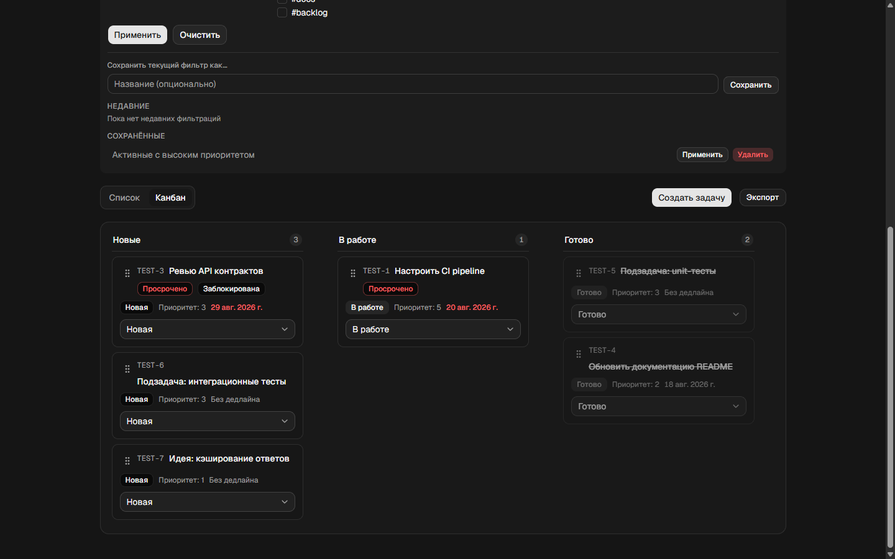

# Task Manager

**Русский** · [English](README.en.md)

Многопользовательский менеджер задач и списков, сделанный для технического задания: списки с режимами Kanban и списка, планирование задач с учётом зависимостей, таймер на каждой задаче с учётом рабочего календаря, уведомления, вложения, комментарии, журнал активности, откат версий и экспорт в CSV/PDF/Excel.



## Стек

- **Next.js 16** (App Router, Route Handlers, Server Components): новая мажорная версия, API которой заметно отличается от предыдущих
- **TypeScript**, строгий режим
- **Redux Toolkit + RTK Query** для серверного состояния (уведомления, комментарии, активность, обновления задач). Остальной UI использует локальное состояние React
- **Zod** для валидации схем, общих у клиента и сервера
- **Tailwind CSS + shadcn/ui** (`shared/ui/*`) на примитивах `@base-ui/react`
- **Vitest + Testing Library** для тестов (более 2000 тестов)
- Локально данные хранятся в файлах, в продакшене в Vercel Blob (см. ниже). Внешней базы данных нет

## Архитектура

Слоистая, примерно в духе Clean Architecture:

```
entities/   pure domain logic + Zod schemas + repositories (schema, model, repository)
features/   one use case each — permission checks, mutations, hooks, RTK Query slices
widgets/    composed UI sections (dialogs, boards, detail panels)
app/        Next.js routes: pages (Server Components) + API route handlers
shared/     cross-cutting: UI primitives, the Redux store, db access, utilities
```

- `entities/*/model.ts` содержит бизнес-логику в виде чистых функций (расчёт приоритета, циклы зависимостей, прошедшее время с учётом календаря, пороги уведомлений, восстановление при откате). Отдельной папки `/domain` намеренно нет: разделение архитектурное, а не физическое.
- `entities/*/repository.ts` это единственный слой, который работает с хранилищем.
- `features/*` оборачивает вызов репозитория или модели в проверку прав (`canViewList`/`canEditList`) и предоставляет либо серверную функцию «for user» (её используют API-роуты), либо клиентский хук.
- API-роуты в `app/api/**` тонкие: аутентификация → вызов feature с проверкой прав → JSON-ответ.

## Требования

- Node.js >= 20.9 (совпадает с требованием самого Next.js 16)
- npm (в репозитории лежит `package-lock.json`, lock-файлов yarn/pnpm нет)

## Быстрый старт

```bash
npm install
npm run dev       # http://localhost:3000
```

```bash
npm run build      # production build (next build)
npm start           # serve the production build
npm test            # vitest run
npm run test:watch  # vitest --watch
npx tsc --noEmit     # type check
npm run lint         # eslint
npx knip              # unused files/exports/deps
```

## Демо-доступ

Заполнено из `data.json`:

| Email | Пароль | Примечания |
|---|---|---|
| `admin@example.com` | `Admin123!` | владеет большинством seed-списков |
| `user@example.com` | `User123!` | имеет общий доступ к некоторым спискам admin |
| `guest@example.com` | `Guest123!` | ограниченный доступ только на чтение, удобен для проверки прав |

Пароли хранятся как хеши вида `demo:<plaintext>` (`entities/user/*`). Это замена настоящему хешированию (например, bcrypt): для локального демо подходит, но **для продакшена небезопасно**.

## Хранение данных и состояние во время работы

Традиционной внешней базы данных нет. Все данные приложения представляют собой один JSON-документ плюс бинарные blob-ы вложений, и работают они через один из двух взаимозаменяемых бэкендов, который выбирается автоматически во время выполнения (`shared/lib/db.ts`, `shared/lib/session-store.ts`, `entities/attachment/storage.ts` экспортируют небольшой интерфейс `*Store` с двумя реализациями):

- **Локальная разработка** (`npm run dev`/`npm start`, `BLOB_READ_WRITE_TOKEN` не задан) использует файлы:
  - `data.json` это seed-набор данных (пользователи, списки, задачи), он лежит в репозитории и при загрузке проверяется по схемам Zod.
  - `.local-state/db.json` это рабочая база данных. При первом чтении она заполняется из `data.json`; каждая мутация читает, обновляет и перезаписывает этот файл. Он в gitignore, а если его удалить, приложение вернётся к seed-данным.
  - `.local-state/attachments/<taskId>/<attachmentId>` хранит байты загруженных файлов на диске под id, который генерирует сервер (а не под именем файла, чтобы избежать path traversal).
  - Сессии тоже хранятся в файлах (`shared/lib/session-store`) по той же причине, что и `db.ts`: Next.js запускает Route Handlers, Server Components и proxy в отдельных графах модулей, поэтому singleton в памяти не был бы общим между ними.
- **Продакшен на Vercel** (есть `BLOB_READ_WRITE_TOKEN`, он задаётся автоматически после подключения Blob-хранилища к проекту) использует [Vercel Blob](https://vercel.com/docs/vercel-blob) с теми же семантикой «прочитать, изменить, записать документ целиком», только хранится всё в приватных blob-ах вместо локальных файлов: `db.json` и `sessions.json` по одному blob-у, и по одному blob-у на вложение в `attachments/<taskId>/<attachmentId>`. Именно это позволяет данным и состоянию сессий и логина действительно сохраняться между запросами на serverless-платформе. См. раздел «Деплой» ниже.
- Vitest всегда использует третью, чисто in-memory реализацию тех же интерфейсов (`process.env.VITEST`), поэтому тесты никогда не трогают диск и сеть.

Каждая запись заменяет документ целиком (файл: запись во временный файл и переименование; Blob: `put` с `allowOverwrite`), поэтому сбой посреди записи не может его повредить, но блокировок между процессами нет, так что параллельные писатели могут конфликтовать. Для масштаба демо этого достаточно, но под нагрузкой это не замена настоящему хранилищу.

## Аутентификация и сессии

Вход по email и паролю (`features/auth/login-form.tsx`) с валидацией в реальном времени и состоянием загрузки. Сессии основаны на cookie и хранятся в файлах; представление истории входов и сессий (`widgets/settings/sessions-section.tsx`) показывает устройство, IP и время для каждой сессии, а действие «выйти везде» отзывает все сессии пользователя сразу. Общая проверка `getCurrentSession` (одинаково используется proxy и API-роутами) везде отклоняет отозванные сессии.

## Основные возможности

- **Списки**: создание (из шаблона), редактирование (с историей), мягкое удаление + восстановление (в течение 30 дней), дублирование, общий доступ (только чтение / редактирование для каждого участника), поиск и фильтры с сохранёнными и недавними фильтрами, экспорт в CSV/PDF.
- **Задачи**: создание, расширенные поля, зависимости (`dependsOn`) с обнаружением циклов и каскадным обновлением статусов, подзадачи с агрегированием прогресса в родительской задаче, мягкое удаление + восстановление, клонирование с изменениями, автоматически генерируемые коды `TEST-N`, которые заполняют пропуски, оставшиеся после удалений.
- **Kanban-доска**: смена статуса перетаскиванием (`features/task/use-kanban-board.ts`) идёт тем же путём обновления, что и ручное редактирование, поэтому правила зависимостей и каскада действуют одинаково в обоих случаях. Есть пустое состояние для каждой колонки, индикатор идущего сохранения и общий баннер ошибки при неудачном перемещении; всё это берётся из одного и того же клиентского состояния мутации, которое отключает и снова включает ручку перетаскивания.
- **Smart Priority**: `entities/task/model.ts:calculatePriority` объединяет близость дедлайна, положение в цепочке зависимостей, приоритет, заданный пользователем, и историческое время на похожие задачи в одну оценку, которая показывается рядом с исходным приоритетом.
- **Completion Prediction**: `entities/task/completion-prediction.ts` прогнозирует время завершения на основе того же календарного движка расчёта времени и провайдера исторических задач, что использует Smart Priority.
- **Таймер**: старт/пауза/продолжение/стоп, сохраняется между перезагрузками; прошедшее время считается на лету из `workDayHours` (календарный движок, который учитывает только рабочие часы), а не хранится как бегущий счётчик.
- **Редактирование на месте и автосохранение**: поля задачи сохраняются по отдельности с ручным debounce (400 мс), оптимистичным обновлением UI и откатом при неудачном запросе; Escape отменяет только редактируемое поле (не передавая событие окружающему диалогу) и возвращает его к последнему сохранённому значению.
- **Вложения**: загрузка/скачивание/удаление для каждой задачи, с проверкой владения, которая привязывает каждое вложение к его задаче (подмена id для доступа невозможна). Загрузка и удаление записываются в журнал активности.
- **Журнал активности**: аудит по каждой задаче (изменения полей, смена статуса, комментарии, вложения, откаты, действия таймера) в `entities/activity/*`; загружается через RTK Query и автоматически инвалидируется после любого действия, которое должно его обновить, так что журнал обновляется на лету без повторного открытия задачи.
- **Откат версий**: восстанавливает прежнее состояние задачи из её истории и показывает diff перед применением; доступ закрыт той же проверкой прав на редактирование, что и любая другая мутация.
- **Комментарии**: на уровне задачи, доступны при праве редактирования; `%1h%` / `%30m%` в тексте комментария увеличивает оценку времени задачи и записывается и в историю, и в журнал активности.
- **Уведомления**: оповещения о пороге времени (75/90/100% оценки) и напоминания о дедлайне списка (15/10/5 мин), доставляются опросом `/api/notifications` (считаются на сервере, дедуплицируются по ключам, подтверждённым пользователем). Два переключателя в настройках действительно работают: включение *пересчёта рабочих часов* показывает подтверждение на экране после сохранения изменения `workDayHours`; включение *изменений других пользователей* открывает `BroadcastChannel`, чтобы соседние вкладки того же браузера сразу обновляли уведомления при закрытии одного из них, а не ждали следующего опроса (см. «Ограничения демо-среды»).
- **Экспорт**: CSV на уровне списка (на клиенте) и PDF (рендер на сервере); CSV, PDF и Excel на уровне задачи. Каждый эндпоинт экспорта заново проверяет права на просмотр списка или задачи на сервере.
- **Error boundary**: `shared/ui/ErrorBoundary.tsx` монтируется один раз вокруг содержимого страниц роутера (`app/app-error-boundary.tsx`, подключён в `app/layout.tsx`), поэтому ошибка рендера в любом месте страницы показывает доступный UI с повтором вместо пустого экрана, и при этом всё приложение не превращается в клиентский компонент.

## Redux Toolkit + RTK Query

Для управления состоянием используется Redux Toolkit; серверное состояние (уведомления, комментарии, обновления задач, активность) ведёт RTK Query. Он выбран ради инвалидации кэша и оптимистичных обновлений вместо самописного состояния fetch/loading/error в каждом хуке. `shared/store/*` содержит настройку стора; каждый срез фичи лежит рядом с самой фичей (например, `features/comment/comments-api.ts`). Не все мутации перенесены: вложения, действия таймера, перетаскивание в Kanban и откат по-прежнему используют обычные обёртки над `fetch`. Это было осознанное решение по границам работы (см. `docs/` с заметками о дизайне), а не недосмотр.

## Деплой

Развёрнуто на Vercel. Чтобы повторить:

1. Импортируйте репозиторий как проект Vercel (Vercel сам определяет Next.js).
2. На вкладке **Storage** проекта создайте хранилище **Blob** и подключите его. Vercel сам добавит `BLOB_READ_WRITE_TOKEN` в окружение проекта; ручная настройка не нужна.
3. Выполните деплой (или повторный деплой, если Blob-хранилище добавлено после первого деплоя, так как токен начинает действовать только на деплоях, сделанных после его подключения).

Без подключённого Blob-хранилища приложение всё равно собирается и запускается на Vercel, но каждый запрос откатывается на файловое хранилище, которое serverless-функции не могут разделять между вызовами, поэтому демо-данные (и любая сессия входа) не сохранялись бы между запросами. О том, как выбирается бэкенд, см. раздел «Хранение данных и состояние во время работы» выше.

Один постоянно работающий процесс Node (виртуальная машина или «always-on» контейнер платформы) с доступным для записи томом под `.local-state/` тоже подходит: файловое хранилище работает как есть, без Blob-хранилища.
